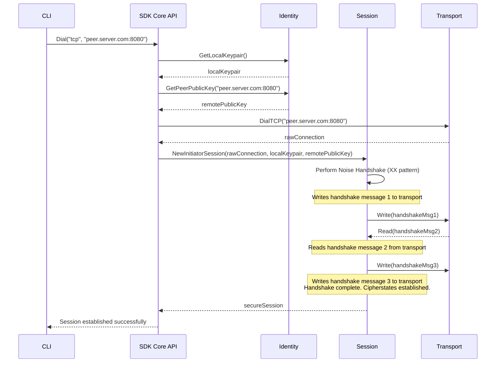

```mermaid
sequenceDiagram
    participant CLI
    participant SDK_Client as SDK Core API
    participant Identity
    participant Session
    participant Transport

    CLI->>SDK_Client: Dial("tcp", "peer.server.com:8080")
    SDK_Client->>Identity: GetLocalKeypair()
    Identity-->>SDK_Client: localKeypair
    SDK_Client->>Identity: GetPeerPublicKey("peer.server.com:8080")
    Identity-->>SDK_Client: remotePublicKey
    SDK_Client->>Transport: DialTCP("peer.server.com:8080")
    Transport-->>SDK_Client: rawConnection
    SDK_Client->>Session: NewInitiatorSession(rawConnection, localKeypair, remotePublicKey)
    Session->>Session: Perform Noise Handshake (XX pattern)
    Note over Session: Writes handshake message 1 to transport
    Session->>Transport: Write(handshakeMsg1)
    Transport-->>Session: Read(handshakeMsg2)
    Note over Session: Reads handshake message 2 from transport
    Session->>Transport: Write(handshakeMsg3)
    Note over Session: Writes handshake message 3 to transport<br>Handshake complete. Cipherstates established.
    Session-->>SDK_Client: secureSession
    SDK_Client-->>CLI: Session established successfully
```
